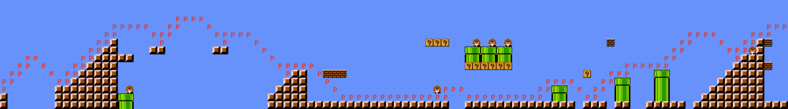
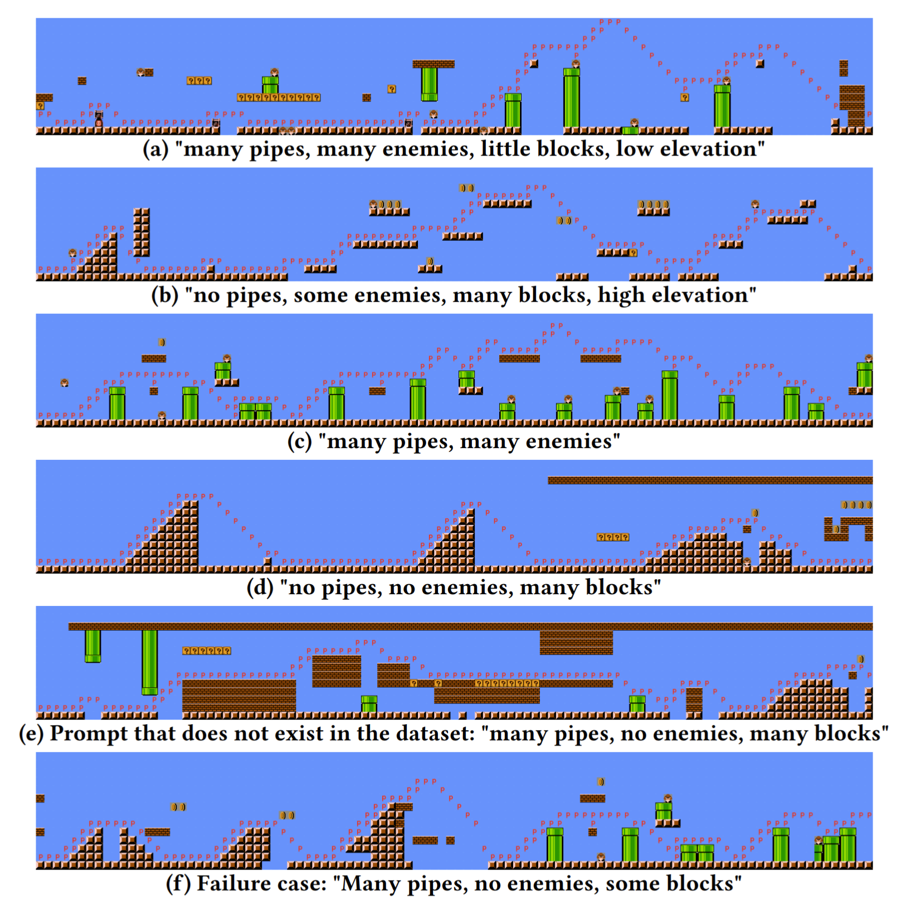

<div align="center">    

# MarioGPT: Open-Ended Text2Level Generation through Large Language Models
[](https://arxiv.org/abs/2302.05981) <a href="https://huggingface.co/spaces/multimodalart/mariogpt"></a>

[Playing Generated Level](#interacting-with-levels)            |  Generated Level
:-------------------------:|:-------------------------:
 | 

</div>


How does it work?
----

Architecture           |  Example Prompt Generations
:-------------------------:|:-------------------------:
 | 


MarioGPT is a finetuned GPT2 model (specifically, [distilgpt2](https://huggingface.co/distilgpt2)), that is trained on a subset Super Mario Bros and Super Mario Bros: The Lost Levels levels, provided by [The Video Game Level Corpus](https://github.com/TheVGLC/TheVGLC). MarioGPT is able to generate levels, guided by a simple text prompt. This generation is not perfect, but we believe this is a great first step more controllable and diverse level / environment generation.


Requirements
----
- python3.8+

Installation
---------------
from pypi
```
pip install mario-gpt
```

or from source
```
git clone git@github.com:shyamsn97/mario-gpt.git
python setup.py install
```


Generating Levels
-------------

Since our models are built off of the amazing [transformers](https://github.com/huggingface/transformers) library, we host our model in https://huggingface.co/shyamsn97/Mario-GPT2-700-context-length

This code snippet is the minimal code you need to generate a mario level!

```python
from mario_gpt import MarioLM, SampleOutput

# pretrained_model = shyamsn97/Mario-GPT2-700-context-length

mario_lm = MarioLM()

# use cuda to speed stuff up
# import torch
# device = torch.device('cuda')
# mario_lm = mario_lm.to(device)

prompts = ["many pipes, many enemies, some blocks, high elevation"]

# generate level of size 1400, pump temperature up to ~2.4 for more stochastic but playable levels
generated_level = mario_lm.sample(
    prompts=prompts,
    num_steps=1400,
    temperature=2.0,
    use_tqdm=True
)

# show string list
generated_level.level

# show PIL image
generated_level.img

# save image
generated_level.img.save("generated_level.png")

# save text level to file
generated_level.save("generated_level.txt")

# play in interactive
generated_level.play()

# run Astar agent
generated_level.run_astar()

# load from text file
loaded_level = SampleOutput.load("generated_level.txt")

# play from loaded (should be the same level that we generated)
loaded_level.play()
...
```

##### See [notebook](notebooks/Sampling.ipynb) for a more in depth tutorial to generate levels

Interacting with Levels
-------------

Right now there are two ways to interact with generated levels:

1) [Huggingface demo](https://huggingface.co/spaces/multimodalart/mariogpt) -- Thanks to the amazing work by [multimodalart](https://github.com/multimodalart), you can generate and play levels interactively in the browser! In addition, gpus are provided so you don't have to own one yourself.
2) Using the [play and astar methods](mario_gpt/simulator/simulator.py). These require you to have java installed on your computer (Java 8+ tested). For interactive, use the `play()` method and for astar use the `run_astar` method. Example:

```python
from mario_gpt import MarioLM

mario_lm = MarioLM()

prompts = ["many pipes, many enemies, some blocks, high elevation"]

generated_level = mario_lm.sample(
    prompts=prompts,
    num_steps=1400,
    temperature=2.0,
    use_tqdm=True
)

# play in interactive
generated_level.play()

# run Astar agent
generated_level.run_astar()
```


## Future Plans
Here's a list of some stuff that will be added to the codebase!

- [x] Basic inference code
- [x] Add MarioBert Model
- [x] Add Interactive simulator
- [ ] Inpainting functionality from paper
- [ ] Open-ended level generation code
- [ ] Training code from paper
- [ ] Different generation methods (eg. constrained beam search, etc.)


Authors
-------
Shyam Sudhakaran <shyamsnair@protonmail.com>, <https://github.com/shyamsn97>

Miguel González-Duque <migd@itu.dk>, <https://github.com/miguelgondu>

Claire Glanois <clgl@itu.dk>, <https://github.com/claireaoi>

Matthias Freiberger <matfr@itu.dk>, <https://github.com/matfrei>

Elias Najarro <enaj@itu.dk>, <https://github.com/enajx>
 
Sebastian Risi <sebr@itu.dk>, <https://github.com/sebastianrisi>

Citation
------
If you use the code for academic or commecial use, please cite the associated paper:
```
@misc{https://doi.org/10.48550/arxiv.2302.05981,
  doi = {10.48550/ARXIV.2302.05981},
  
  url = {https://arxiv.org/abs/2302.05981},
  
  author = {Sudhakaran, Shyam and González-Duque, Miguel and Glanois, Claire and Freiberger, Matthias and Najarro, Elias and Risi, Sebastian},
  
  keywords = {Artificial Intelligence (cs.AI), Computation and Language (cs.CL), FOS: Computer and information sciences, FOS: Computer and information sciences},
  
  title = {MarioGPT: Open-Ended Text2Level Generation through Large Language Models},
  
  publisher = {arXiv},
  
  year = {2023},
  
  copyright = {arXiv.org perpetual, non-exclusive license}
}

```
